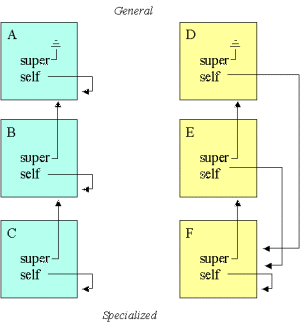

# Classes and objects in Scheme

在Scheme中实现类和对象.

## a. 类和对象

函数定义可以解释为一个类，并且函数调用可以扮演对象的角色。换句话说，lambda表达式可以被视为类，而闭包可以被视为对象。

下面定义一个`point`类，lambda表达式将作为`point`类的实例对象句柄返回。这个对象句柄实际上是一个调度程序，它在给定message参数作为输入的情况下返回匹配的方法。 

```
(define (point x y)
  (letrec ((getx (lambda () x))
           (gety (lambda () y))
           (add  (lambda (p)
                    (point
                       (+ x (send 'getx p))
                       (+ y (send 'gety p)))))
           (type-of (lambda () 'point)))
    (lambda (message)
      (cond ((eq? message 'getx) getx)
            ((eq? message 'gety) gety)
            ((eq? message 'add)  add)
            ((eq? message 'type-of) type-of)
            (else (error #f "Message not understood"))))))
```

在`add`方法中，我们使用`send`函数向对象发送消息。`send`函数仅查找方法，并使用`apply`来调用方法。

```
(define (send message obj . par)
  (let ((method (obj message)))
    (apply method par)))
```

## b. 类的通用模式

一个类通常包含：构造参数、实例变量、方法和self方法。方法除了通过上面的`letrec`定义外，还可以通过`define`来简化定义。

```
(define (class-name construction-parameters)
 (let ((instance-var init-value)
        ...)

   (define (method parameter-list)
     method-body)

   ...

   (define (self message)
     (cond ((eqv? message selector) method)
	   ...

	   (else (error #f "Undefined message" message))))

   self))
```

我们再实现一个实例化对象的函数，顺便给`send`函数增加一点错误处理能力。

```
(define (new-instance class . parameters)
  (apply class parameters))

(define (send message object . args)
  (let ((method (object message)))
    (cond ((procedure? method) (apply method args))
          (else (error #f "Error in method lookup " method)))))
```

## c. 类的示例

现在我们重新写一下`point`类

```
(define (point x y)
 (let ((x x) 
       (y y))

   (define (getx) x)

   (define (gety) y)

   (define (add p)
    (point
     (+ x (send 'getx p))
     (+ y (send 'gety p))))

   (define (type-of) 'point)

   (define (self message)
     (cond ((eqv? message 'getx) getx)
           ((eqv? message 'gety) gety)
           ((eqv? message 'add)  add)
           ((eqv? message 'type-of) type-of)
	   (else (error #f "Undefined message" message))))

   self))
```

下面我们模拟一个场景，其中我们创建了两个点，并将它们绑定到变量`p`和`q`，再将`p`与`q`的和绑定到变量`p+q`。最后我们通过`send`发送`getx`和`gety`消息来检查结果是否符合预期。

```
1> (define p (new-instance point 2 3))

2> (send 'getx p)
2

3> (define q (new-instance point 4 5))

4> (define p+q (send 'add p q))

5> (send 'getx p+q)
6

6> (send 'gety p+q)
8
```

## d. 继承

上面我们已经在Scheme中简单的模拟了类和对象，继承是面向对象中更高级的概念。

我们先将对象简单的分成两部分`super`(super part)和`self`(subclass part)。基类的对象是上半部分，
我们将其绑定到`super`，分派器`dispatch`作为下半部分仍然绑定到`self`。

```
(define (class-name parameters)
 (let ((super (new-part super-class-name some-parameters))
       (self 'nil))
   (let ((instance-variable init-value)
         ...)

     (define (method parameter-list)
       method-body)
     ...

     (define (dispatch message)
       (cond ((eqv? message 'selector) method)
             ...
             (else (method-lookup super message))))

     (set! self dispatch))

   self))
```

下面将实现一个大多数面向对象语言中都有的基础类`object`。所有对象可以通过继承形成一个`super`链，`object`的`super`为空，作为整个`super`派发链的终结。

```
(define (object)
  (let ((super '())
        (self 'nil))

   (define (dispatch message)
       '())

   (set! self dispatch)
   self))
```

我们再添加`new-instance`、`new-part`、`send`和`method-lookup`这几个函数来对面向对象做更完善的支持。`new-part`用于构造对象的部件，而`new-instance`用于构造具体类型的对象，这里暂时看上去长得一样。

```
(define (new-instance class . parameters)
  (apply class parameters))

(define (new-part class . parameters)
  (apply class parameters))

(define (method-lookup object selector)
 (cond ((procedure? object) (object selector))
       (else
         (error #f "Inappropriate object in method-lookup: "
                 object))))

(define (send message object . args)
 (let ((method (method-lookup object message)))
  (cond ((procedure? method) (apply method args))
        ((null? method)
         (error #f "Message not understood: " message))
        (else
         (error #f "Inappropriate result of method lookup: "
                 method)))))
```

## e. 继承的示例

我们借用c小节的示例`point`类型，在此基础上，我们通过继承来派生出一个带颜色的点`color-point`类型。

```
(define (color-point x y color)
 (let ((super (new-part point x y))
       (self 'nil))
   (let ((color color))

     (define (get-color)
       color)

     (define (type-of) 'color-point)

     (define (dispatch message)
       (cond ((eqv? message 'get-color) get-color)
             ((eqv? message 'type-of) type-of)
             (else (method-lookup super message))))

     (set! self dispatch))

   self))
```

测试下我们的颜色点，并将两个颜色点相加(注意，两个颜色点相加后不是颜色点，只是普通的点)

```
1> (define cp (new-instance color-point 5 6 'red))

2> (send 'get-color cp)
red

3> (send 'getx cp)
5

4> (send 'gety cp)
6

5> (define cp-1 (send 'add cp (new-instance color-point 1 2 'green))) 

6> (send 'getx cp-1)
6

7> (send 'gety cp-1)
8

8> (send 'type-of cp-1)
point

9> (send 'get-color cp-1)
Undefined message get-color
```

## f. self解释

继承的模拟涉及将对象部分聚合为整体对象。为了将整个对象绑定在一起，`self`所有部分的(对象句柄)必须指向最专门的对象部分。

图中展示了我们想要实现的目标。左侧的绿色层次结构显示了现在的情况，其中`self`每个级别均指向当前对象部分。右侧的黄色层次结构显示了我们希望建立的情况。



`self`必须指向最顶层的对象部分，如果不是这样，就根本无法从“非顶层对象部分”访问“顶层对象部分”

## g. 虚拟方法示例

现在展示虚拟方法的效果。我们将定义一个基类`x`，一个子类`y`(`y`继承自`x`)。在这2个对象中，我们都将看到一个额外的方法`set-self!`，该方法负责将`self`更改为适当的对象。注意！使用`x`和`y`类的程序员对`set-self!`不感兴趣，所以`set-self!`方法是对象的内部事务。

```
(define (x)
 (let ((super (new-part object))
       (self 'nil))

   (let ((x-state 1))

     (define (get-state) x-state)

     (define (res)
       (send 'get-state self))

     (define (set-self! object-part)
         (set! self object-part)
         (send 'set-self! super object-part))

     (define (self message)
         (cond ((eqv? message 'get-state) get-state)
               ((eqv? message 'res) res)
               ((eqv? message 'set-self!) set-self!)
               (else (method-lookup super message))))

      self)))
```

```
(define (y)
 (let ((super (new-part x))
       (self 'nil))

   (let ((y-state 2))

     (define (get-state) y-state)

     (define (set-self! object-part)
         (set! self object-part)
         (send 'set-self! super object-part))

     (define (self message)
         (cond ((eqv? message 'get-state) get-state)
               ((eqv? message 'set-self!) set-self!)
               (else (method-lookup super message))))

      self)))
```

下面是一个小示例，它可以解释`self`的效果。将`res`消息发送到`y`对象`b`会得到值`2`，表明该`res`方法调用了`y`对象的`get-state`（不是`x`的`get-state`）。`y`的`res`方法是从`x`继承而来。

```
1> (define a (new-instance x))

2> (define b (new-instance y))

3> (send 'res a)
1

4> (send 'res b)
2
```

为了得到上面示例的结果，我们对`new-instance`函数还需要做一些小小的修改。我们在`new-instance`中调用一个`virtual-operations`的函数，该函数将`set-self!`消息发送到对象，这将依次激活所有级别对象的`set-self!`方法。

```
(define (new-instance class . parameters)
 (let ((instance (apply class parameters)))
   (virtual-operations instance)
   instance))

(define (virtual-operations object)
  (send 'set-self! object object))
```

## h. 面向对象的一些思考

这里只是在Scheme中对面向对象的一个简单模拟。在此基础上，我们还可以实现一个更完善的面向对象系统。例如：

1. 通过槽(`Slot`)来管理属性和方法(槽是Key/Value对的列表)
2. 所有的动作(`actions`)都是消息
3. 对象与对象之间只能通过消息来交互
4. 基于原型链(`Prototypes`)的方式实现继承(当对象收到一条消息时，它会寻找一个匹配的槽，如果找不到，则查找将首先在其原型中递归地继续进行)
5. 多重继承只需要将原型添加到对象的原型链中即可(当响应消息时，查找机制对原型链进行深度优先搜索)
6. 对象的继承和实例化可以都通过复制(`clone`)的方式进行

## i. 参考资料

* [示例代码(Github)](https://github.com/shixiongfei/oop-scheme)
* [clos](http://community.schemewiki.org/?CLOS)
* [clos for chez](https://github.com/theschemer/clos)
* [Simulation of object-oriented mechanisms in Scheme - A technical report](http://people.cs.aau.dk/~normark/pp-*/oop-scheme.pdf)
